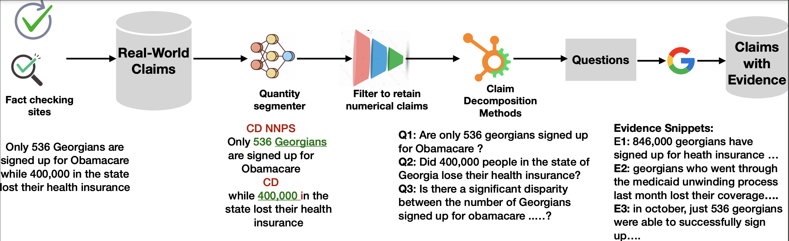

# QuanTemp

This is a SIGIR 2024 benchmark and inference pipeline for fact-checking real-world numerical and temporal claims.

It provides:
- A large multilingual claim dataset with veracity labels (`True`, `False`, `Conflicting`)
- Fine-grained claim taxonomy labels (`statistical`, `temporal`, `comparison`, `interval`)
- Pre-computed BM25 evidence retrieval results
- Claim decomposition questions used to improve evidence grounding
- Inference and evaluation scripts for reproducing reported results

<p align="center">
  
</p>

---

## Table of Contents

1. [Quick Facts](#quick-facts)
2. [What is QuanTemp?](#what-is-quantemp)
3. [Key Concepts](#key-concepts)
4. [Repository Contents](#repository-contents)
5. [Data Overview](#data-overview)
6. [End-to-End Pipeline](#end-to-end-pipeline)
7. [External Assets — What to Download & Where to Place Them](#external-assets--what-to-download--where-to-place-them)
8. [Setup From Scratch (Local Machine)](#setup-from-scratch-local-machine)
9. [Run Inference](#run-inference)
10. [Evaluate Predictions](#evaluate-predictions)
11. [Statistical Significance Test](#statistical-significance-test)
12. [How to Demo This Project to Others](#how-to-demo-this-project-to-others)
13. [All Available Models](#all-available-models)
14. [Dataset Format Reference](#dataset-format-reference)
15. [Notes on Auxiliary Scripts](#notes-on-auxiliary-scripts)
16. [Extending the Codebase](#extending-the-codebase)
17. [Results Summary](#results-summary)
18. [Troubleshooting](#troubleshooting)
19. [Citation](#citation)
20. [License](#license)

---

## Quick Facts

- **Paper:** [QuanTemp: A real-world open-domain benchmark for fact-checking numerical claims](https://arxiv.org/pdf/2403.17169)
- **Venue:** SIGIR 2024 · [ACM DOI](https://doi.org/10.1145/3626772.3657874)
- **Core task:** 3-way claim veracity prediction (`True`, `False`, `Conflicting`) with evidence-aware NLI
- **Taxonomy:** `statistical`, `temporal`, `comparison`, `interval`
- **Languages:** Mostly English with some multilingual examples
- **Best baseline macro-F1:** 58.32 (FinQA-RoBERTa + ClaimDecomp, retrieved evidence)

---

## What is QuanTemp?

QuanTemp is the **first large-scale, real-world benchmark exclusively focused on verifying numerical claims**. Most existing fact-checking datasets focus on textual claims from Wikipedia, but approximately 36% of all check-worthy claims in political discourse involve numerical quantities. Current NLI models trained on mixed datasets underperform by up to 11.78% compared to models specifically fine-tuned on numerical claims — QuanTemp exists to close that gap.

The dataset contains **15,514 real-world numerical claims** scraped from 45 fact-checking websites (Politifact, Snopes, FullFact, etc.), each annotated with a veracity label, a taxonomy label, an evidence corpus of 423,320 web-scraped snippets with BM25 relevance scores, and detailed metadata.

---

## Key Concepts

### Claim Taxonomy

| Label | Description | Example |
|---|---|---|
| `statistical` | Claims with statistics or percentages | "7,000 jobs were created in the marine sector" |
| `temporal` | Claims referencing a point or period in time | "GDP grew faster in 2022 than any prior decade" |
| `comparison` | Claims comparing two or more numerical quantities | "Country A has 3× more debt than Country B" |
| `interval` | Claims involving a numerical range | "Between 400,000 and 500,000 people were affected" |

### Veracity Labels

| Label | Meaning |
|---|---|
| `True` | Claim is supported by evidence |
| `False` | Claim is contradicted by evidence |
| `Conflicting` | Evidence neither clearly supports nor refutes the claim |

The dataset is intentionally skewed toward `False`, reflecting the real-world focus of fact-checkers on disinformation. This is why **macro-F1** is used as the primary metric — it weights all three classes equally regardless of their frequency.

### NLI Label Mapping

The inference model internally outputs `SUPPORTS`, `REFUTES`, or `CONFLICTING`. These are mapped to the final output labels `True`, `False`, and `Conflicting` respectively before writing results.

---

## Repository Contents

After cloning and downloading external assets, your directory tree should look like this:

```
QuanTemp/
│
├── code/
│   ├── nli_inference/
│   │   └── veracity_prediction.py          # Main inference script
│   ├── evaluation/
│   │   ├── eval_veracity_prediction.py     # Compute F1 metrics
│   │   ├── statistical_tests.py            # Paired t-test between two runs
│   │   └── eval_questions.py               # Question quality eval (archival, see notes)
│   ├── data_processing/
│   │   ├── quantity_segmenter.py           # Quantity tagging via CoreNLP (see notes)
│   │   └── setfit_taxonomy_training.py     # Taxonomy classifier training (see notes)
│   ├── utils/
│   │   ├── load_veracity_predictor.py      # Loads model weights from .zip
│   │   └── data_loader.py                  # Data loading helpers
│   └── notebooks/
│       ├── finqa_roberta_nli_training_quantemp.ipynb   # Training notebook (FinQA-RoBERTa)
│       └── oracle_roberta_mnli_quantemp.ipynb          # Oracle experiment notebook
│
├── data/
│   ├── raw_data/
│   │   ├── train_claims_quantemp.json      # 9,935 training claims
│   │   ├── val_claims_quantemp.json        # 3,084 validation claims
│   │   └── test_claims_quantemp.json       # 2,495 test claims
│   ├── decomposed_questions/
│   │   └── test/
│   │       ├── test_claimdecomp.csv        # Sub-questions via ClaimDecomp
│   │       └── test_programfc.json         # Sub-questions via ProgramFC
│   ├── bm25_scored_evidence/
│   │   └── bm25_top_100_claimdecomp.json.zip  # ← Must be extracted before use
│   ├── complex_num_facts_categorized_subset.csv
│   └── fact_checkers.json
│
├── models/                                 # ← YOU CREATE THIS (not in the clone)
│   └── finqa_roberta_claimdecomp_early_stop_2/
│       └── model_weights.zip               # ← Downloaded from Google Drive
│
├── output/                                 # Inference results land here (auto-created)
│
├── pipeline.png
├── quantemp-logo-480.png
├── quantemp.png
├── requirements.txt
└── README.md
```

> **Note:** The `models/` directory does **not** exist in the cloned repo. You must create it and populate it manually — see [External Assets](#external-assets--what-to-download--where-to-place-them).

---

## Data Overview

### Split Sizes

| Split | File | Claims |
|---|---|---|
| Train | `train_claims_quantemp.json` | 9,935 |
| Validation | `val_claims_quantemp.json` | 3,084 |
| Test | `test_claims_quantemp.json` | 2,495 |

### Veracity Label Distribution

| Split | False | True | Conflicting |
|---|---|---|---|
| Train | 5,770 | 1,824 | 2,341 |
| Val | 1,795 | 617 | 672 |
| Test | 1,423 | 474 | 598 |

### Taxonomy Label Note

Taxonomy distribution covers the four expected classes (`statistical`, `temporal`, `comparison`, `interval`), but a small number of entries have **trailing whitespace** (e.g. `"temporal   "`). If you write custom preprocessing that filters or groups by `taxonomy_label`, always call `.strip()` on the value first to avoid silent mismatches.

---

## End-to-End Pipeline

The codebase is organized around this four-stage flow:

```
Raw Claim
    │
    ▼
[1] Claim Decomposition   ← ClaimDecomp or ProgramFC
    │   Generate sub-questions from the claim
    ▼
[2] Evidence Retrieval    ← BM25 over web-scraped corpus (pre-computed)
    │   Top-100 evidence snippets per claim/question
    ▼
[3] NLI Inference         ← Fine-tuned RoBERTa / FinQA-RoBERTa
    │   Predicts SUPPORTS / REFUTES / CONFLICTING
    │   Mapped to True / False / Conflicting
    ▼
[4] Evaluation            ← Macro-F1, per-class metrics, optional significance test
```

---

## External Assets — What to Download & Where to Place Them

There are **two Google Drive locations** referenced in this project. Below is exactly what each contains and where each file goes.

---

### Asset 1 — Model Weights (Required to run inference)

Three fine-tuned models are available. Download the one you want and place it under `models/`.

| Model | Evidence type | Download |
|---|---|---|
| FinQA-RoBERTa | Retrieved (BM25) — best in ablations table | [Download](https://drive.google.com/file/d/1LR-w4kZ-r8KNV3IcXvvxMREWV2vQXx8Y/view?usp=drive_link) |
| ClaimDecomp RoBERTa-large-MNLI | Retrieved (BM25) — best in main results table | [Download](https://drive.google.com/file/d/1klH8TJsxRDsiVj5ewkbS8AHOqlRxqH03/view?usp=drive_link) |
| Oracle RoBERTa-large-MNLI | Oracle (gold evidence) — upper bound | [Download](https://drive.google.com/file/d/1Lt4bnwgQ1Vw1B8okOjO0QmdyuVT8nwVt/view?usp=drive_link) |

For the default reproduction command, download the **FinQA-RoBERTa** model and place it at:

```text
models/
  finqa_roberta_claimdecomp_early_stop_2/
    model_weights.zip
```

Create the directory first:

```bash
mkdir -p models/finqa_roberta_claimdecomp_early_stop_2
# Then place model_weights.zip inside it
```

If your downloaded filename or folder name differs from the above, pass the exact path with `--model_path` when running inference.

---

### Asset 2 — BM25 Evidence File (Requires extraction)

The BM25 evidence file is included in the repository **as a zip archive** and must be extracted before use:

```text
data/bm25_scored_evidence/bm25_top_100_claimdecomp.json.zip  ← exists in repo
data/bm25_scored_evidence/bm25_top_100_claimdecomp.json      ← you must extract this
```

Extract it:

```bash
unzip data/bm25_scored_evidence/bm25_top_100_claimdecomp.json.zip \
  -d data/bm25_scored_evidence/
```

---

### Asset 3 — Full Retrieval Corpus (Optional)

**Drive link:** https://drive.google.com/drive/folders/1GYzSK0oU2MiaKbyBO3hE8kO4gdmxDjCv?usp=drive_link

This is the full 423,320-snippet web-scraped evidence corpus. **You do not need this** to reproduce paper results — the pre-computed BM25 JSON already covers that. Download it only if you want to:
- Re-run retrieval with a different method (e.g. dense retrieval, TF-IDF)
- Experiment with different top-K retrieval depths
- Audit for search result drift over time

If you download it, place the corpus files under `data/corpus/`.

---

## Setup From Scratch (Local Machine)

### Step 1 — Clone the repo

```bash
git clone https://github.com/factiverse/QuanTemp.git
cd QuanTemp
```

### Step 2 — Create a Python virtual environment

Always use a dedicated virtual environment to avoid dependency conflicts with your system Python.

```bash
python3 -m venv .venv
source .venv/bin/activate       # On Windows: .venv\Scripts\activate
python -m pip install --upgrade pip
```

### Step 3 — Install dependencies

Install the base dependencies declared by the repo:

```bash
pip install -r requirements.txt
```

Install additional packages required by the evaluation and analysis scripts (not included in `requirements.txt`):

```bash
pip install torch evaluate scipy datasets
```

Install the optional taxonomy training dependency (only needed for `setfit_taxonomy_training.py`):

```bash
pip install setfit
```

### Step 4 — Extract the BM25 evidence file

```bash
unzip data/bm25_scored_evidence/bm25_top_100_claimdecomp.json.zip \
  -d data/bm25_scored_evidence/
```

### Step 5 — Download and place model weights

Follow [Asset 1 — Model Weights](#asset-1--model-weights-required-to-run-inference) above to download and place your chosen model.

### Step 6 — Verify your setup

Run these checks before executing anything to confirm all required files are in place:

```bash
ls data/raw_data/test_claims_quantemp.json
ls data/bm25_scored_evidence/bm25_top_100_claimdecomp.json
ls data/decomposed_questions/test/test_claimdecomp.csv
ls models/finqa_roberta_claimdecomp_early_stop_2/model_weights.zip
```

---

## Run Inference

Run from the **repo root** with your virtual environment active:

```bash
python3 code/nli_inference/veracity_prediction.py \
  --test_path data/raw_data/test_claims_quantemp.json \
  --bm25_evidence_path data/bm25_scored_evidence/bm25_top_100_claimdecomp.json \
  --base_model roberta-large-mnli \
  --model_path models/finqa_roberta_claimdecomp_early_stop_2/model_weights.zip \
  --questions_path data/decomposed_questions/test/test_claimdecomp.csv \
  --output_path finqa_roberta_claimdecomp_test
```

### Argument Reference

| Argument | Description |
|---|---|
| `--test_path` | JSON file with claims to run inference on |
| `--bm25_evidence_path` | Pre-scored BM25 evidence (top-100 snippets per claim) |
| `--base_model` | HuggingFace model ID used for tokenizer architecture |
| `--model_path` | Path to the downloaded fine-tuned model weights `.zip` |
| `--questions_path` | Decomposed sub-questions aligned to test claims |
| `--output_path` | **Name prefix only** — the script automatically prepends `output/` |

> ⚠️ **Important:** Pass only a filename stem to `--output_path`, not a full path. The script prepends `output/` internally. Passing `finqa_roberta_claimdecomp_test` writes results to `output/finqa_roberta_claimdecomp_test.{csv,json}`. Passing `output/finqa_roberta_claimdecomp_test` will produce broken nested paths.

### Output Files

The script writes two files to `output/`:

```
output/finqa_roberta_claimdecomp_test.csv   ← per-claim predictions (used by eval script)
output/finqa_roberta_claimdecomp_test.json  ← same predictions in JSON format
```

> **Note on first run:** On first execution, `sentence-transformers/paraphrase-MiniLM-L6-v2` (~90 MB) is downloaded from HuggingFace and cached locally. Subsequent runs use the cached version and are faster.

---

## Evaluate Predictions

```bash
python3 code/evaluation/eval_veracity_prediction.py \
  --test_path data/raw_data/test_claims_quantemp.json \
  --output_path output/finqa_roberta_claimdecomp_test.csv
```

This prints:
- Per-class precision, recall, and F1 for `True`, `False`, `Conflicting`
- Confusion matrix
- Macro, weighted, and micro F1

### Category-Wise Evaluation

To evaluate on a specific taxonomy category only:

```bash
python3 code/evaluation/eval_veracity_prediction.py \
  --test_path data/raw_data/test_claims_quantemp.json \
  --output_path output/finqa_roberta_claimdecomp_test.csv \
  --category temporal \
  --category_wise True
```

Valid values for `--category`: `statistical`, `temporal`, `comparison`, `interval`.

---

## Statistical Significance Test

To test whether the difference between two runs is statistically significant, use the paired t-test script over 10 folds:

```bash
python3 code/evaluation/statistical_tests.py \
  --test_path data/raw_data/test_claims_quantemp.json \
  --output_path_1 output/unified_claimdecomp_final.csv \
  --output_path_2 output/claim_only_numdecomp_final_5.csv
```

Pass the two prediction CSV files you want to compare via `--output_path_1` and `--output_path_2`.

---

## How to Demo This Project to Others

### Fast Demo (no training required)

1. Open `data/raw_data/test_claims_quantemp.json` and walk through a few entries, pointing out `claim`, `label`, and `taxonomy_label` to illustrate the diversity of numerical claim types
2. Run `veracity_prediction.py` on the test split with the downloaded model (5–10 min on CPU)
3. Open `output/*.csv` and show predicted vs ground-truth labels side by side
4. Run `eval_veracity_prediction.py` and present the macro-F1 score

### Live Walkthrough Narrative

Trace one claim through the full pipeline step by step:

1. **Claim** — e.g. *"Under GOP plan, U.S. families making $86k see avg tax increase of $794"*
2. **Decomposed questions** — show the sub-questions generated by ClaimDecomp from `test_claimdecomp.csv`
3. **BM25 evidence** — show the top-3 retrieved snippets for that claim from the BM25 JSON
4. **NLI prediction** — model reads claim + evidence and outputs `REFUTES` → mapped to `False`
5. **Ground truth** — label is `False`; show the confusion matrix to put the result in context

### Key Talking Points

- The best macro-F1 is only ~58.32, compared to ~90+ on FEVER — numerical claims are a genuinely hard open research problem
- Models pre-trained on numerical data (FinQA) outperform general NLI models by up to 11.78%, motivating domain-specific pre-training
- The `Conflicting` class is the hardest — evidence neither confirms nor refutes, requiring careful reasoning about uncertainty

---

## All Available Models

| Model | Evidence Type | Description | Download |
|---|---|---|---|
| **FinQA-RoBERTa** | Retrieved (BM25) | Best in ablations table; pre-trained on FinQA for numerical understanding | [Link](https://drive.google.com/file/d/1LR-w4kZ-r8KNV3IcXvvxMREWV2vQXx8Y/view?usp=drive_link) |
| **ClaimDecomp RoBERTa-large-MNLI** | Retrieved (BM25) | Best in main results table | [Link](https://drive.google.com/file/d/1klH8TJsxRDsiVj5ewkbS8AHOqlRxqH03/view?usp=drive_link) |
| **Oracle RoBERTa-large-MNLI** | Oracle (gold evidence) | Upper-bound result using gold evidence | [Link](https://drive.google.com/file/d/1Lt4bnwgQ1Vw1B8okOjO0QmdyuVT8nwVt/view?usp=drive_link) |

To use a different model, download it, place the `.zip` under `models/<folder_name>/model_weights.zip`, then update `--model_path` and `--base_model` in the inference command accordingly.

---

## Dataset Format Reference

### Raw Claims (`data/raw_data/*.json`)

Each entry is a JSON object:

```json
{
  "country_of_origin": "usa",
  "label": "Conflicting",
  "url": "https://www.politifact.com/factchecks/...",
  "lang": "en",
  "claim": "Repealing the sales tax on boats in Rhode Island has spawned 2,000 companies, 7,000 jobs and close to $2 billion a year in sales activity.",
  "doc": "Full fact-check article body text...",
  "taxonomy_label": "statistical",
  "label_original": "half-true"
}
```

| Field | Type | Description |
|---|---|---|
| `country_of_origin` | string | Country code of claim origin |
| `label` | string | Normalised veracity: `True`, `False`, or `Conflicting` |
| `url` | string | Source fact-check article URL |
| `lang` | string | Language code (predominantly `en`) |
| `claim` | string | The numerical claim text to verify |
| `doc` | string | Full article body from the fact-checking website |
| `taxonomy_label` | string | `statistical`, `temporal`, `comparison`, or `interval` — always `.strip()` before use |
| `label_original` | string | Original site label (e.g. `half-true`, `pants-on-fire`) before normalization |

### Decomposed Questions (`data/decomposed_questions/test/`)

- `test_claimdecomp.csv` — Sub-questions generated by **ClaimDecomp** for focused evidence retrieval
- `test_programfc.json` — Sub-questions generated by **ProgramFC**

### BM25 Evidence (`data/bm25_scored_evidence/`)

`bm25_top_100_claimdecomp.json` (after unzipping) maps each claim ID to its top-100 BM25-scored evidence snippets retrieved against the ClaimDecomp sub-questions. This pre-computed file avoids re-querying search engines and ensures reproducibility as live search results drift over time.

---

## Notes on Auxiliary Scripts

These scripts exist in the repo but have known caveats — read before trying to run them.

**`code/data_processing/quantity_segmenter.py`**
Performs quantity tagging and segmentation on raw claim text. It calls a **Stanford CoreNLP server** at `http://localhost:9000` via the `pycorenlp` library. You must download CoreNLP and start the server separately before this script will function. See [Stanford CoreNLP docs](https://stanfordnlp.github.io/CoreNLP/) for setup instructions.

**`code/data_processing/setfit_taxonomy_training.py`**
A research script for training a SetFit-based taxonomy classifier on the four claim types. It contains **legacy hardcoded file paths** that must be updated to your local paths before use. Requires `pip install setfit`.

**`code/evaluation/eval_questions.py`**
Evaluates the quality of decomposed questions (fluency, diversity). It imports two modules — `utils.fluency` and `utils.diversity` — that **are not included** in this repository. Treat it as archival/experimental code unless you implement or supply those missing modules yourself.

**`code/notebooks/`**
The two Jupyter notebooks contain the training code used to produce the released model weights. They are provided for transparency and reproducibility of the training process, but are not required to reproduce evaluation results.

---

## Extending the Codebase

### Using a Different Decomposition Method

Swap `--questions_path` to use ProgramFC instead of ClaimDecomp:

```bash
python3 code/nli_inference/veracity_prediction.py \
  --questions_path data/decomposed_questions/test/test_programfc.json \
  ... (other args unchanged)
```

### Running on a Different Split

```bash
# Validation set
--test_path data/raw_data/val_claims_quantemp.json

# Training set (for sanity checks or overfitting analysis)
--test_path data/raw_data/train_claims_quantemp.json
```

Note: corresponding decomposed questions and BM25 evidence for splits other than `test` may need to be generated if not already present.

### Training a New NLI Model

The repo ships inference-only scripts. To train from scratch:
1. Use the notebooks in `code/notebooks/` as a starting point
2. Train on `train_claims_quantemp.json` + `val_claims_quantemp.json`
3. Fine-tune any HuggingFace NLI model (e.g. `roberta-large-mnli`, `microsoft/deberta-v3-large`) on the 3-class veracity task, using claim + sub-questions + top-K BM25 evidence snippets as input
4. Save final weights as `model_weights.zip` and pass to the existing inference and evaluation scripts

---

## Results Summary

Best reported results from the paper (macro-F1 on test set):

| Method | Evidence | Macro-F1 |
|---|---|---|
| RoBERTa-large-mnli (zero-shot) | Retrieved | ~44.x |
| FinQA-RoBERTa + ClaimDecomp | Retrieved (BM25) | **58.32** |
| RoBERTa-large-mnli | Oracle (gold) | Upper bound |

Key finding: models pre-trained for numerical understanding (FinQA) outperform generic NLI models by up to **11.78% macro-F1**. Fine-tuned smaller models also outperform GPT-3.5-Turbo under zero-shot and few-shot conditions on this benchmark.

---

## Troubleshooting

**`FileNotFoundError` for the BM25 evidence file**
The file ships as a `.zip` and must be extracted first:
```bash
unzip data/bm25_scored_evidence/bm25_top_100_claimdecomp.json.zip -d data/bm25_scored_evidence/
```

**`FileNotFoundError` for model weights**
Ensure `--model_path` points to the exact location of the downloaded `.zip`. If you placed it differently from the recommended layout, pass the full relative path explicitly.

**`ModuleNotFoundError: No module named 'evaluate'` or `'scipy'`**
These are not in `requirements.txt`. Install them separately:
```bash
pip install evaluate scipy datasets
```

**`ModuleNotFoundError: No module named 'torch'`**
```bash
pip install torch
```

**`ModuleNotFoundError: No module named 'setfit'`**
Only needed for the taxonomy training script:
```bash
pip install setfit
```

**Slow first run**
On first execution, `sentence-transformers/paraphrase-MiniLM-L6-v2` (~90 MB) is downloaded from HuggingFace and cached locally. Subsequent runs are faster.

**Taxonomy label mismatches in custom code**
A small number of `taxonomy_label` values contain trailing whitespace (e.g. `"temporal   "`). Always call `.strip()` on `taxonomy_label` before comparisons or groupby operations.

**Wrong output path / broken output files**
The inference script automatically prepends `output/` to `--output_path`. Always pass a filename stem only:
```bash
# Correct
--output_path my_run_name

# Wrong — produces nested or broken paths
--output_path output/my_run_name
```

---

## Citation

```bibtex
@inproceedings{V:2024:SIGIR,
  title     = {{QuanTemp}: A real-world open-domain benchmark for fact-checking numerical claims},
  author    = {Venktesh V and Abhijit Anand and Avishek Anand and Vinay Setty},
  url       = {https://arxiv.org/pdf/2403.17169},
  doi       = {10.1145/3626772.3657874},
  year      = {2024},
  date      = {2024-06-26},
  booktitle = {Proceedings of the 47th International ACM SIGIR Conference on Research and Development in Information Retrieval},
  series    = {SIGIR '24},
  pubstate  = {published},
  tppubtype = {inproceedings}
}
```

---

## License

[](http://creativecommons.org/licenses/by-nc/4.0/)

The **dataset and model weights** are licensed under [Creative Commons Attribution-NonCommercial 4.0 International](http://creativecommons.org/licenses/by-nc/4.0/).

The **inference code** in this repository is MIT licensed.

> ⚠️ **Non-commercial use only** applies to the dataset and pre-trained models. For commercial use, contact the authors.
